# ISS 2023: Gas sensor 

### Authors
Romain Moulin & Aude Jean-Baptiste, 5ISS 2023-2024

# Introduction
The objective of this project is to integrate a gas sensor that we made ourselves during a training period at AIME (Atelier Interuniversitaire de Micro Electronique) and send its data over a Lora network to a dashboard to see and analyse the values.

# Initiation to Electronics and Arduino programming
As we both come from a computer science background (4IR-SC), we used the first labs as an introduction to Arduino and Kicad. We tested some small projects from simply making a LED from an Arduino blink to collecting data sent by a Nunchunck (A nintendo WII controller). We also designed an android application able to communicate and interact with an arduino.

 *Screenshot of our Android application*

These first sessions were really usefull to understand the basics of Arduino programming and electronics. These small projects were a good introduction to the real project of this course.

# Lora network integration

To begin our project, we first tried to connect an arduino to the Lora network. To do so, we used a RN2483 chip made by Microship which is a module that is able to communicate on a Lora network. As this chip only has tiny connectors, we needed to weld the component to a board that would have bigger connectors for the communication with the arduino. The following image features the board with an antenna for the 868MHz frequency band. 

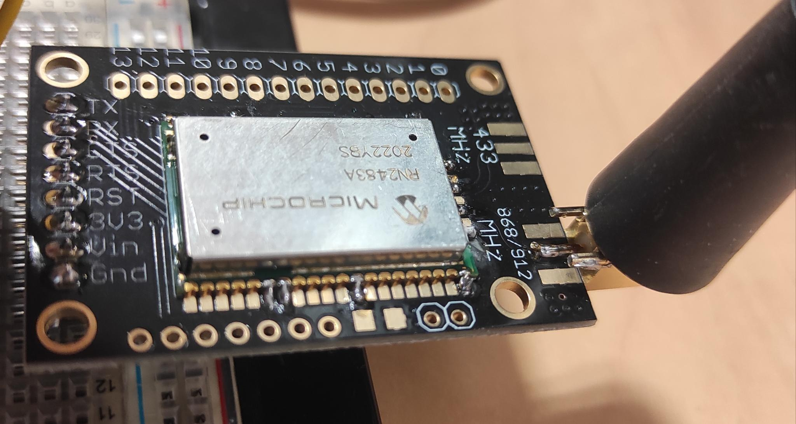 *RN2483 Module weld on the board*

After this step, we were able to connect our arduino to the INSA's Lora network. For this, we used *The Things Network* library for arduino, the code is available [here](./Arduino-Code/lora_connection/lora_connetion.ino).
For this, we had used the otaa authentication method. We got the device ID using the library and the application ID and key on the [chirpstack's INSA website](https://srv-chirpstack.insa-toulouse.fr/#/login) (please note that this server is only available if you are directly connected to INSA's network, or using a VPN). 

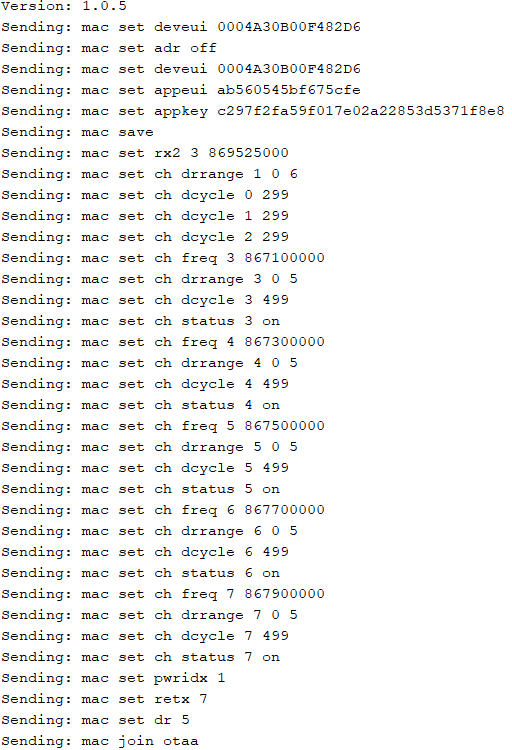 *Authentication of the arduino to the Lora network*

# Integration of the MQ-3B gas sensor

With the established connection, we had to send data to the gateway in order to retrive it and display it on a dashboard. As a first implementation of this application we connected an alreay made gas sensor which is the MQ-3B gas sensor to our arduino. The final montage of our circuit is the following:

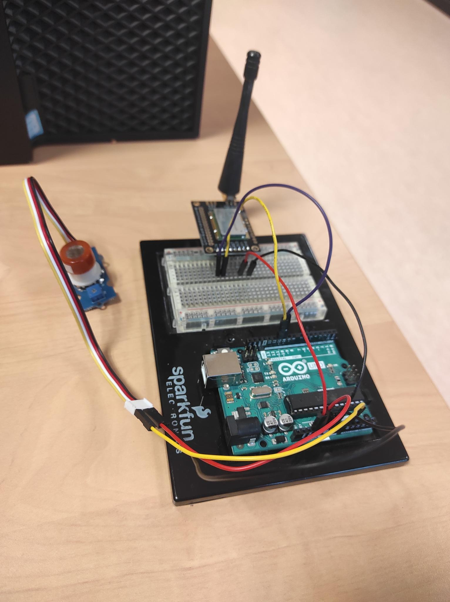 *Montage of the circuit with the MQ-3B gas sensor*

After that we changed our arduino code to read the value from the gas sensor and send it to our LoRa network. As the max value we can get from the sensor is 1024, we encoded the information on 2 bytes before sending it.

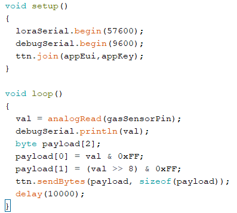 *Our arduino setup and loop functions*

# Design of a node-red application

As the data is received by the LoRa network, we could visualize it on the chirpstack web page. However, it is not fitted for a real usage of our gas sensor. A user of gas sensor would like to see the state of the sensor in real time in a dashboard. To do so, we decided to use node-red and MQTT.

MQTT is a communication protocol particulary used for IoT devices. With this protocol there are two kind of nodes, the publisher and the subscribers. Publishers publish data in a topic and subscriber get all the data published on a specific topic. This protocol is supported by chirpstack which automatically upload the data it receives in a MQTT topic. 

Node-red is a web-browser flow editor that helps to easily connect flows. It provides visual coding with blocks for the ease of conception. It also implements dashboard library to display the data is user friendly dahsboards. We used a MQTT subscribe block to get the data from chirpstack that we pipe into a javascript function that decodes the data (it is encoded in base64 by chirpstack). Finaly we send the decoded data to a dashboard block to visualize the data.

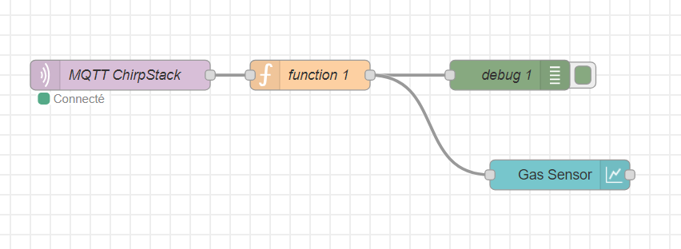 *The node-red flow*

# Test of the MQ-3B solution

To test our sensor, we putted hydroalcoholic gel near it to see if we could see it on our dashboard. This experience was a succes and we were able to see on the dashboard the increase of the gas rate near the sensor.

 *Dashboard for the witness experience in ambient air*

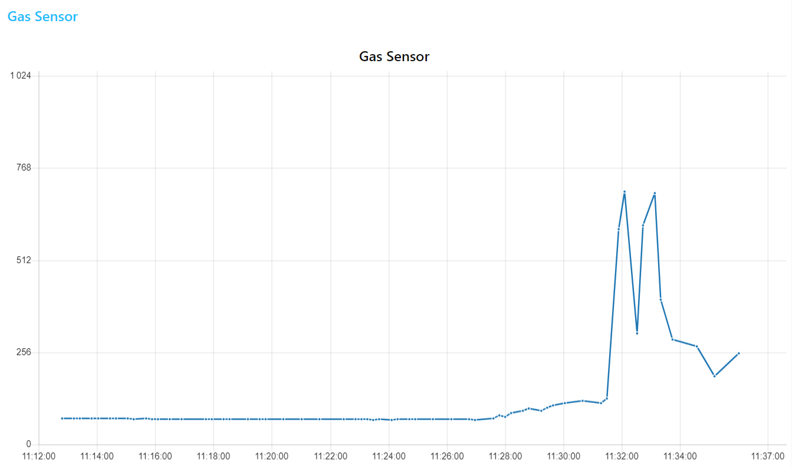 *Dashboard for the experience with alcoholic gel*

# Integration of our gas sensor from AIME 

The specifications of our gas sensor are detailed in the datasheet (see below). In order to replace the commercial sensor (MQ-3B) by our gas sensor in our previously detailed monitoring solution with Lora and node-red, we need to follow various steps. 

Indeed, our sensor per se is passive; changes in its resistance allow us to monitor gas presence. We will power and control the sensor through an arduino uno and get its data with the ADC (analog digital converter),  like we did with the MQ-3B. 

The screenshots on the following part have been extracted from our Kicad project, that you can find [here](./MOSH). 

## Transimpedance amplifier

The first stage to treat sensor data is a transimpedance amplifier that will allow us to shape the signal for it to be detected by the arduino's ADC. This stage contains 3 low-pass filters with the following cut-off frequencies and roles: 
- filter 1: 16Hz - this filter is here to eliminate as much noise from the sensor as possible
- filter 2: 1.6Hz - this filter should get rid off the 50Hz noise
- filter 3: 1.6kHz - this filter should adapt the signal to the arduino's ADC 

This circuit was simulated on LTSpice to test the properties of the different filters and of the transimpedance amplifier per se. You can find all the related work in [this directory](./ltspice-stuff)

The transimpedance amplifier is featured in the following image. 

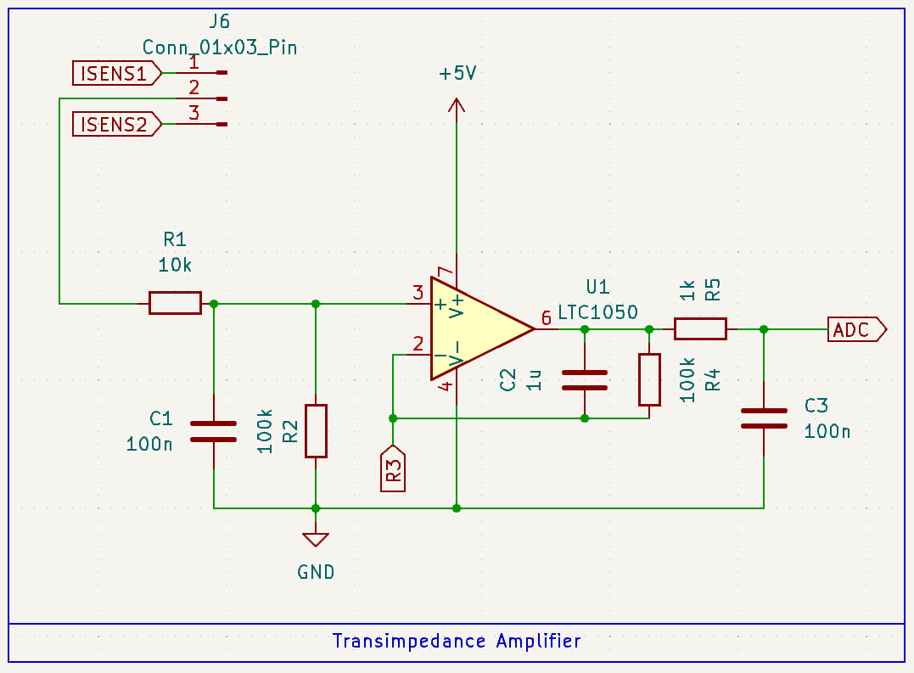 *Our transimpedance amplifier stage*

You might notice that what we called R3 on this schematic is not a resistor. Indeed, we need to apply a variable resistance to the reverser entry of the operationnal amplifier. This variable resistor is detailed in the next subsection. 

## Digital potentiometer

We use a digital potentiometer as a variable resistor. We choose a MCP41100. This component is powered on 5V and controlled by the arduino via SPI (3 pins: Clock, MOSI and CS). 

The following image features the schematic for this component. 

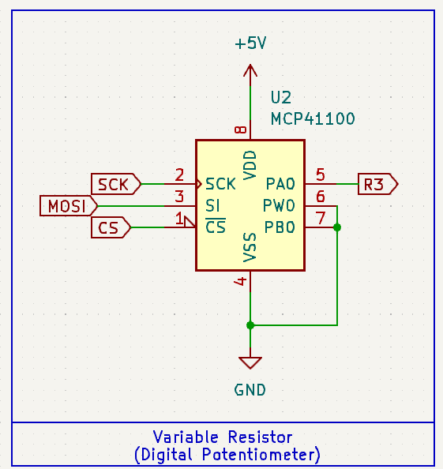 *Montage for the digital potentiometer*

## Heating resistor controlled via PWM 

Our sensor is a "smart sensor". It contains a heating resistor (a polysilicon resistor) as well as a temperature sensor (an aluminium resistor). The heating resistor needs to be controlled by the arduino via PWM, which is possible thanks to the following montage with a IRF540N transistor. 

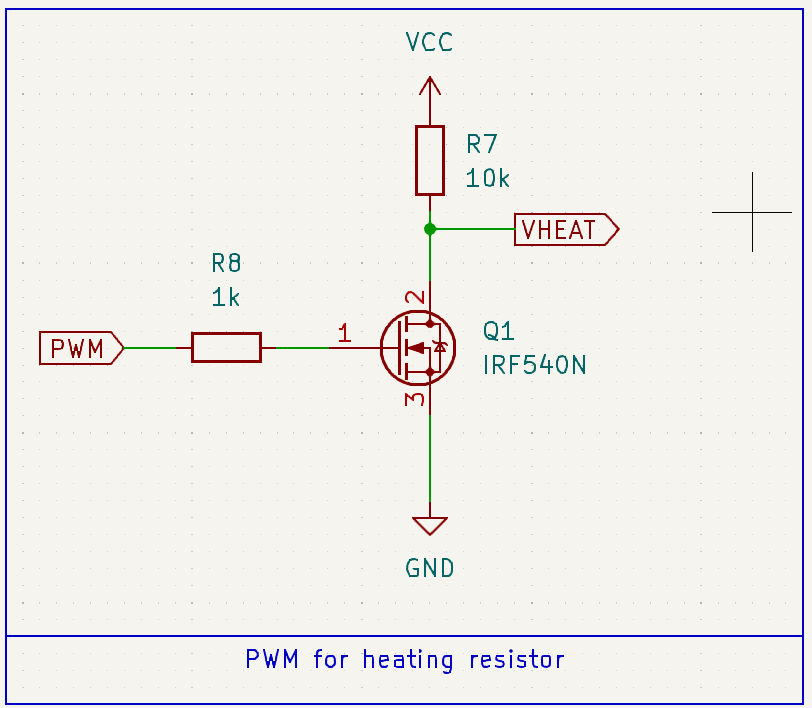 *PWM montage with transistor*

## Sensor connections 

We designed a symbol in Kicad for our sensor. You can find the library [here](./Library_AJB_RM_0). The symbol is associated with the Package_TO_SOT_THT:TO-5-10 footprint, on which our sensor has been mounted. 

The schematic of the sensor connections is featured below. 

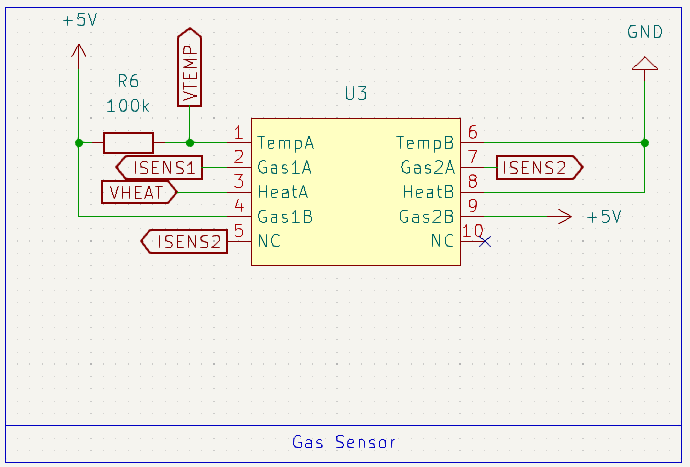 *Our gas sensor connections on the schematic*

## PCB design 

We designed a PCB to integrate our sensor with all the previously described stages. 

This PCB is featured in the following figure. 

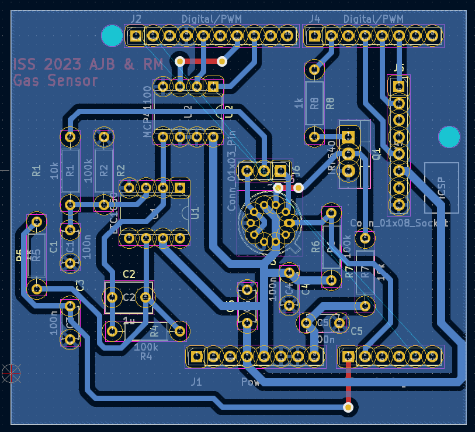 *Our PCB for sensor integration*

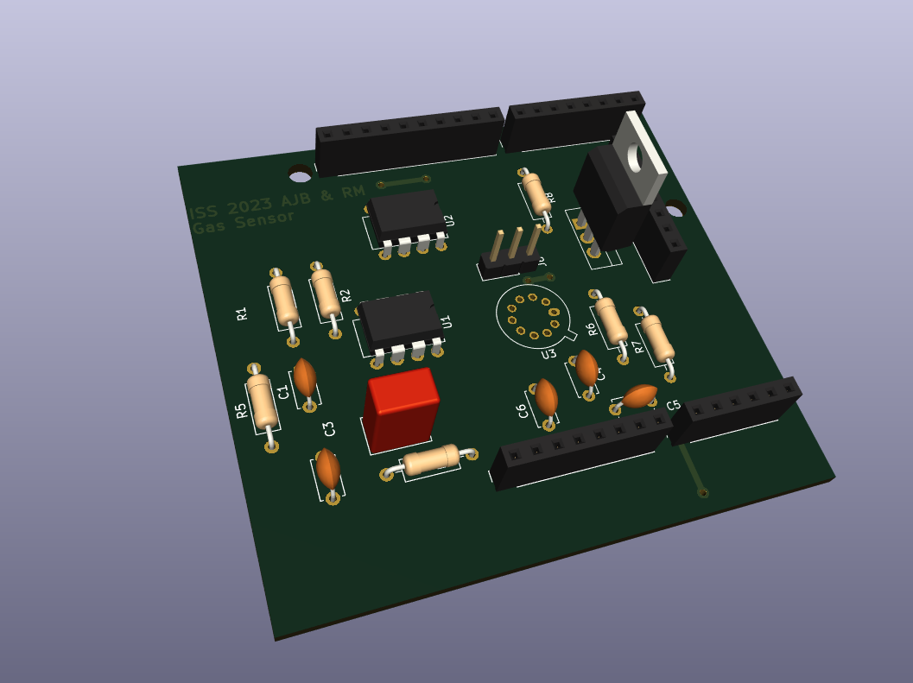 *A nice 3D view of our PCB*

We followed these clearance and track size rules: 

Name|Clearance|Track Width|Via size|Via Hole
---|---|---|---|---
Default	| 0.2 mm	| 0.25 mm	| 0.6 mm	| 0.4 mm	
power	| 0.2 mm	| 1.2 mm	| 0.6 mm	| 0.4 mm	

**Minimum clearance: 0.8mm**

**Minimum track width: 0.8mm**

**Minimum via diameter: 1.5mm**

This PCB is far from perfect as we are two computer science students. We did not had the time to print it and integrate it with a real sensor. 

We can cite some ways to improve it if we were to continue the project:
- the vias could be bigger and better placed, especially the one for the ADC track.
- there is some clearance violations on the gas sensor, because we had to adopt less stricts rules to be able to route the sensor's tracks.
- there are quite a lot of right angles on the 5V track that we were not able to eliminate but that could be problematic.
- some angles on the PCB are acute, even if we tried to avoid them.
- you can notice that we connected one of the non connected pins of the sensor to ISENS2 to facilitate routing.
- there is a problem with the transistor that would disturb the placement of the arduino, it should be changed. 

# Datasheet of our gas sensor from AIME 

We realized a datasheet for our gas sensor that you can find [here](./Datasheet.pdf). 

You might realize that it does not include the graphs that show the evolution of sensor's resistance with gas presence, because we were not given this year's data from AIME training period (and our nano particles synthesis did not worked as expected anyway). Furthermore, the previous years' data were uncomplete as they were not labeled with the gas' names.  

# To go further

As we did not had time to print the PCB, some obvious steps to bring our work further would be: 
- print the PCB
- weld all the components
- test the electrical circuits
- write code to control the heating resistor and the potentiometer
- create a retrocontrolled loop to manage sensor's temperature
- test the sensor reactivity to NH3 and C2H6O 
- test the whole system with Lora transmission of the data and display in the node-red application
- enjoy a fully smart sensor ;-) 

# Conclusion

This project was a great start to finish introduction to the world of sensors, from fabrication to integration of the data on user-friendly dashboards. We were able to develop or reinforce skills in various fields like Lora communication, node-red applications, or PCB design. 
